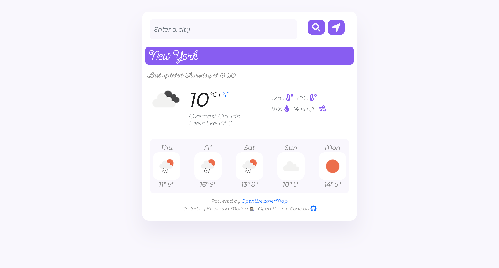

# Vanilla Weather App

This is my weather app project for the SheCodes Plus Workshop that I successfully completed in April 2022. [SheCodes](https://www.shecodes.io/).

## Table of contents

- [Overview](#overview)
  - [Screenshot](#screenshot)
  - [Links](#links)
- [My process](#my-process)
  - [Built with](#built-with)
  - [What I learned](#what-i-learned)
  - [Continued development](#continued-development)
- [Author](#author)
- [Acknowledgments](#acknowledgments)

**Note: Delete this note and update the table of contents based on what sections you keep.**

## Overview

### Screenshot



### Links

- Live Site URL: [Vanilla Weather App](https://kruskii-vanilla-weather-app.netlify.app/)

## My process

### Built with

- Semantic HTML5 markup
- CSS custom properties
- Bootstrap
- Axios
- Navigator
- OpenWeatherMap API

### What I learned

This project was quite challenging and I learned alot about Javascript and working with APIs. Specifically with using APIs (axios, navigator and connecting to the OpenWeatherApp to connect to over the weather of over 200,000+ cities in the world). I am most proud of this particular JS code that I'm really proud of where I injected html to display the upcoming five day forecast for a city:

```js
function displayForecast(response) {
  let forecast = response.data.daily;

  let forecastElement = document.querySelector("#forecast");

  let forecastHTML = `<div class="row">`;

  forecast.forEach(function (forecastday, index) {
    if (index < 5) {
      forecastHTML =
        forecastHTML +
        ` <div class="col">
                <div class="forecast-time">${formatDay(forecastday.dt)}</div>
                
                <div class="forecast-temp">
                  <span class="temp-high">${Math.round(
                    forecastday.temp.max
                  )}°</span> ${Math.round(forecastday.temp.min)}°
                </div>
          </div>
              `;
    }
  });

  forecastHTML = forecastHTML + `</div>`;
  forecastElement.innerHTML = forecastHTML;
}
```

### Continued development

I am focusing on learning responsive web design with CSS flexbox and grid as well as JS frameworks such as React. It's one area that I'm not fully comfortable with. I'm enrolled in an new workshop with SheCodes for Responsive webdesign.

## Author

- SheCodes Profile - [Kruskaya Molina](https://www.shecodes.io/students/553-kruskaya-molina)
- LinkedIn Profile - [Kruskaya Molina](https://www.linkedin.com/in/kruskaya/)

## Acknowledgments

I want to thank Matt Delac and the team at SheCodes for their support
